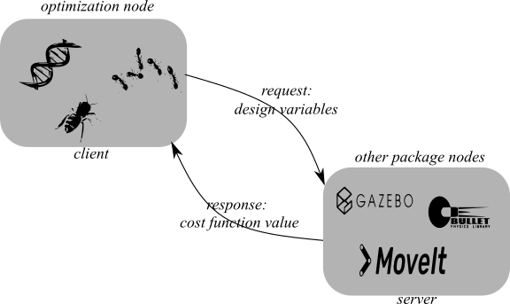

# ROS_Based_Optimization
## Descripton 
In this Repository we want to bring optimization algorithms for 
ROS-based systems. The Robot Operating System (ROS) is a set of software libraries and tools that help you build robot applications
<a href="https://www.ros.org/" target="_blank">[1]</a>. In addition,ROS equips robotic engineers with a complete set of tools for simulating and testing robotic systems. 
There are various variables in the design, construction and control of robots, and the search space for designing and selecting these variables is very wide. To solve such problems, using optimization methods is a right choice. Today, many advancements have been made in the field of optimization and various algorithms have been proposed, which evolutionary algorithms (<a href="https://www.ros.org/" target="_blank">EA</a>) are one of the most important. 
So this work is in the field of evolutionary robotics (ER). ER aims to automatically synthesize robotic body plans and control software by means of evolutionary computation <a href="https://www.researchgate.net/publication/41401257_Evolution_of_Adaptive_Behavior_in_Robots_by_Means_of_Darwinian_Selection" target="_blank">[2]</a>. Some open issues that need further research in ER are discussed in <a href="https://www.researchgate.net/publication/284171614_Open_Issues_in_Evolutionary_Robotics" target="_blank">[3]</a>. Also, another source reviewed was the <a href="https://www.researchgate.net/publication/326236690_Evo-ROS_integrating_evolution_and_the_robot_operating_system" target="_blank">research</a> of Glen A. Simon et al., Who described the <a href="https://github.com/jaredmoore/EvoROS" target="_blank">Evo-ROS</a> framework which is intended to help bridge the gap between the evolutionary and traditional robotics communities. 
The structure of this work is such that in the optimization package, different optimization algorithms are implemented in different ROS nodes. These nodes use ROS actions "client and server" to calculate their cost function. In fact, for any optimization problems that may arise in other packages, a server must be written to return the value of the cost function for the various design variables sent by the optimizer. This cost function can be based on the output of the simulation and other tools provided by ROS. 

 

The advantages of this structure are:
* Optimizations can be made based on the results of simulation tools such as Gazbo, Pybullet, MoveIt, ...
* You can have nodes with Python or C++ and use the features of both languages.
* Optimization results can be implemented on real ROS-based robots.

## Installation & Example Usage
:heavy_check_mark: Tested on Ubuntu 20.04 & ROS Noetic  
:heavy_check_mark: It is assumed that you have installed ROS and are familiar with its concepts (<a href="http://wiki.ros.org/ROS/Tutorials" target="_blank">more info</a>) 
There are two packages in this repository. One is optimization, in which optimization algorithms are implemented, and the other is eval_funcs, where nodes related to problems that need optimization can be placed. So far, only binary genetic algorithm have been implemented. Also one max problem have been implemented in eval_func package for testing the structure (Inspired by Jason Brownlee's <a href="https://machinelearningmastery.com/simple-genetic-algorithm-from-scratch-in-python/" target="_blank">post</a>). 

1. Create & build a catkin workspace.  
`mkdir -p catkin_ws/src` 
`catkin_make`
2. Put two packages of this repository in src folder and build again.  
3. Open a terminal in workspace folder and first run ROS core. 
`roscore` 
4. Open a new terminal and first source your workspace. after that run the one_max node. 
`source devel/setup.bash` 
`rosrun eval_funcs one_max` 
5. Open a new terminal and first souce. after that run optimization node. 
`source devel/setup.bash` 
`rosrun optimization optimization src/optimization/src/GAInput.txt`  
:x: The path of the file containing the algorithm parameters must be specified as the last argument.
6. Open a new terminal and see that the optimization node publishes the best amount of cost during the algorithm. 
`rostopic echo /best_eval` 

## To Do list
* Add new algorithms.
* Add optimizations based on simulation.
